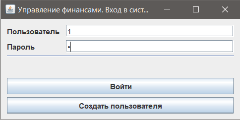
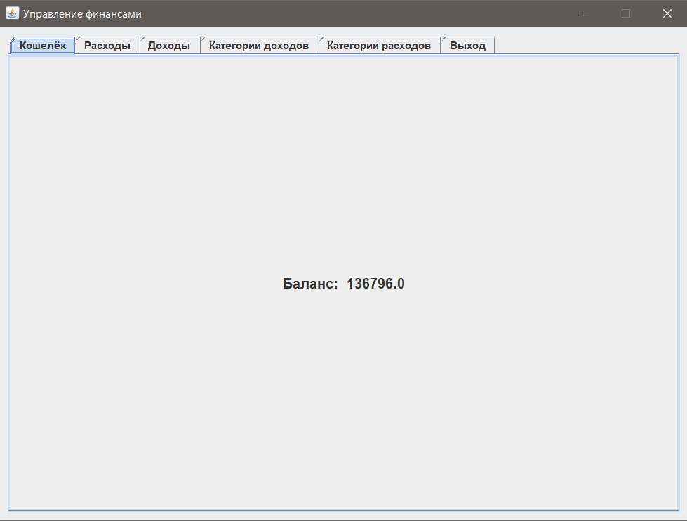
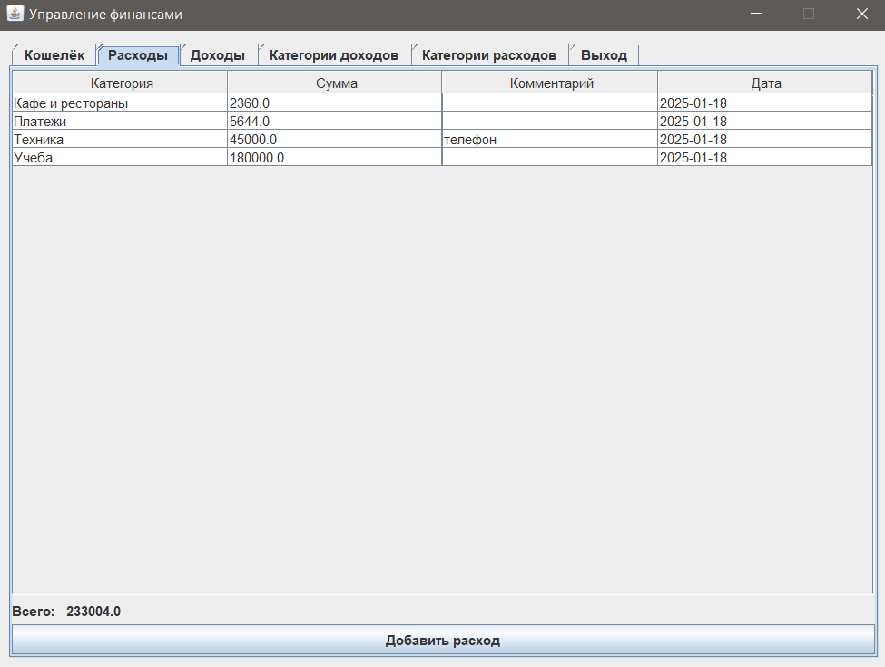
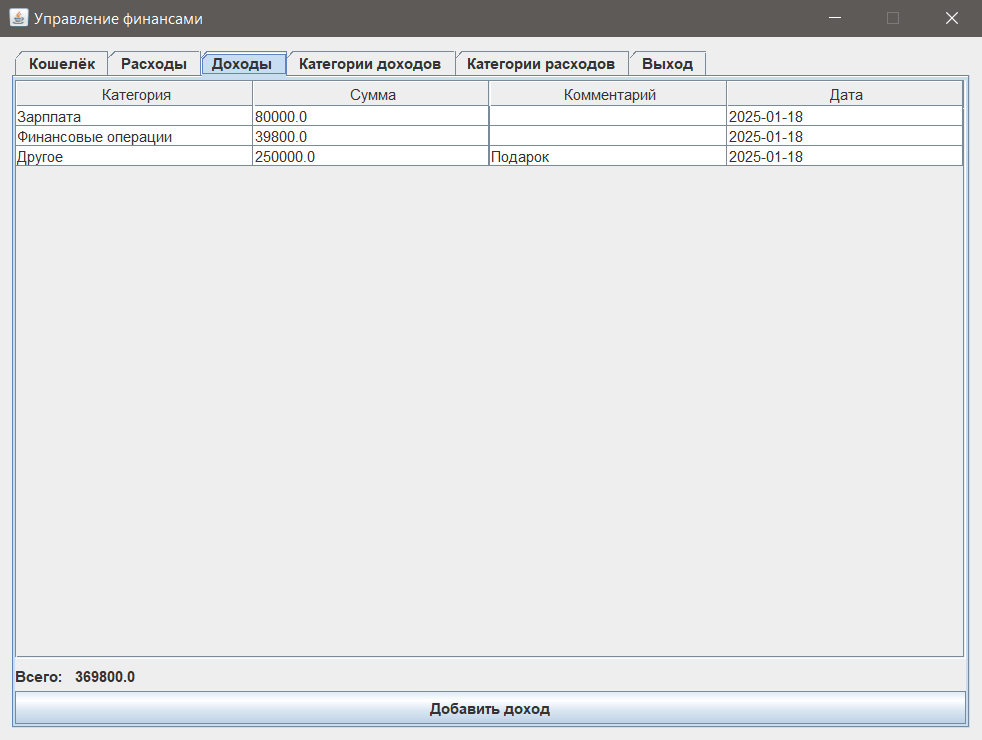
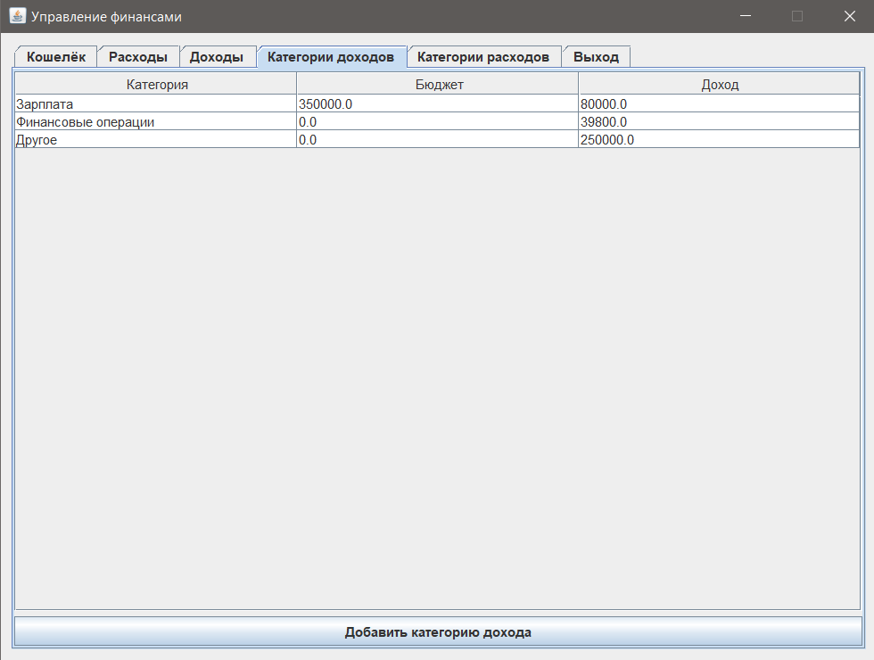
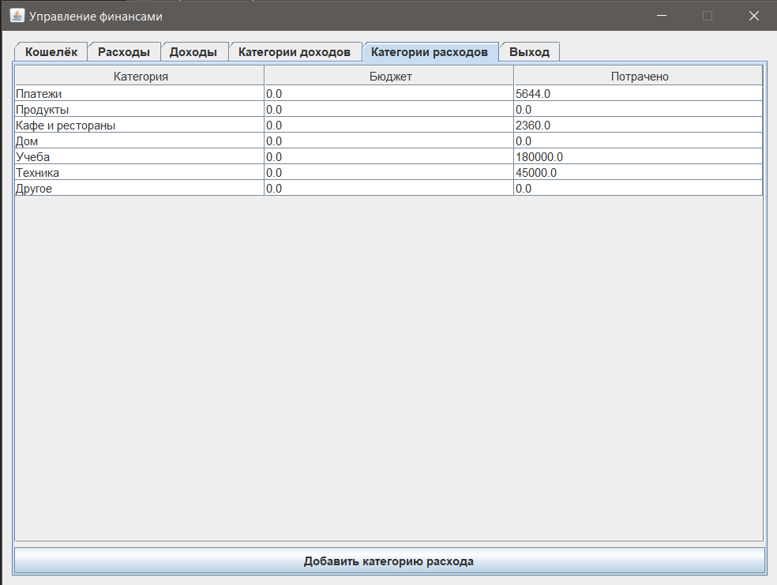
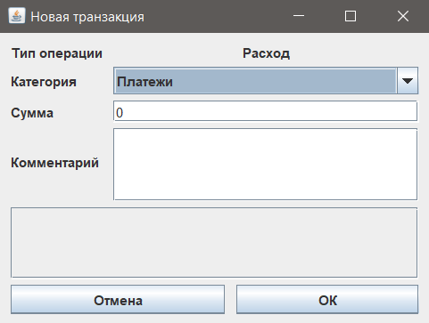
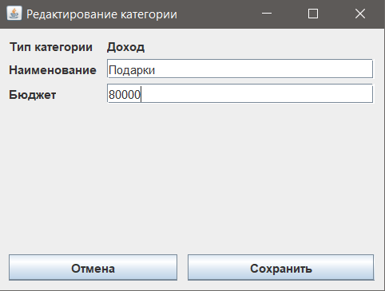

# MIFI_Private_Finance
## Приложение для управления личными финансами

## Обзор
Это приложение предназначено для управления личными финансами. Оно позволяет пользователям отслеживать доходы, расходы и планировать бюджет. Программа поддерживает нескольких пользователей, каждый из которых имеет собственный кошелек и финансовые данные.

---

## Функционал

### Авторизация пользователей
- Возможность регистрации и входа с использованием логина и пароля.
- Все данные привязываются к учетной записи пользователя.

### Управление кошельком
- У каждого пользователя есть собственный кошелек, содержащий:
    - Текущий баланс.
    - Историю доходов и расходов.
    - Установленные бюджеты для категорий.

### Управление финансами
- **Учет доходов и расходов**:
    - Добавление доходов и расходов с указанием категорий.
- **Управление категориями**:
    - Создание пользовательских категорий для планирования бюджета.
    - Установка лимитов бюджета для категорий.
- **Мониторинг бюджета**:
    - Просмотр текущего состояния бюджета по категориям.
    - Отображение общей суммы по категории для мониторинга превышения лимита.

### Отчеты и анализ
- Отображение общей суммы доходов, расходов и детализированного разбора по категориям.
- Просмотр остатка бюджета и лимитов по каждой категории.

### Проверка данных
- Валидация введенных пользователем данных.
- Уведомления о некорректном вводе.

### Сохранение данных
- Все данные хранятся в БД SQLite. Файл создается в рабочей папке приложения.

---

## Использование
- Интуитивно понятный графический интерфейс, написанный с использованием Swing

### Форма входа

### Кошелек

### Расходы

### Доходы

### Категории доходов

### Категории расходов

### Форма добавления транзакции

### Форма редактирования/добавления категории

---

## Лицензия
- Проект распространяется под лицензией MIT License.

### Автор
- Разработано Алексей Муравьев, 2025г.
